# ColorPOOLmd
- Compact
- Practical
- Formatted 한 Presentation

## 사용방법

### 배색 조합 추천받기
- team Color : 원하는 색상 선택
    - 색코르기
    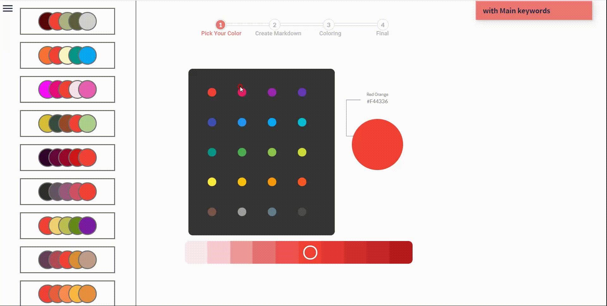

    - 배색 조합 고르기
    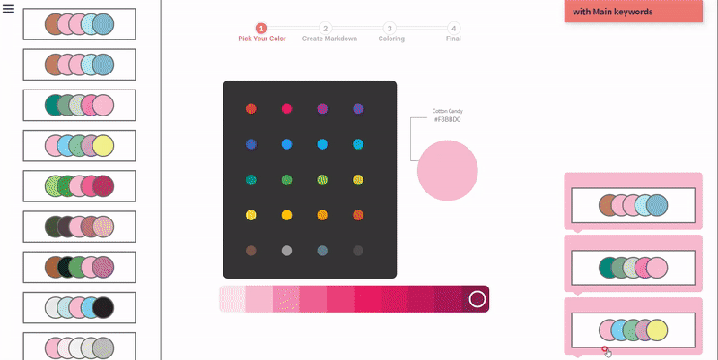
 
- mainKeyword : 발표 키워드로 색상 검색
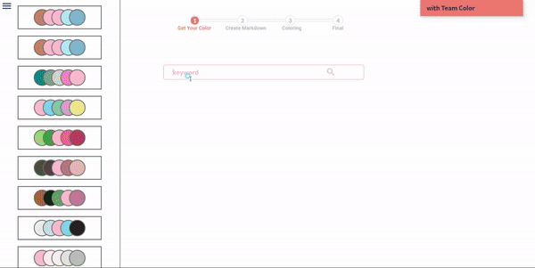

  
### 발표 자료 작성
- Manual : 마크다운 문법 직접 사용
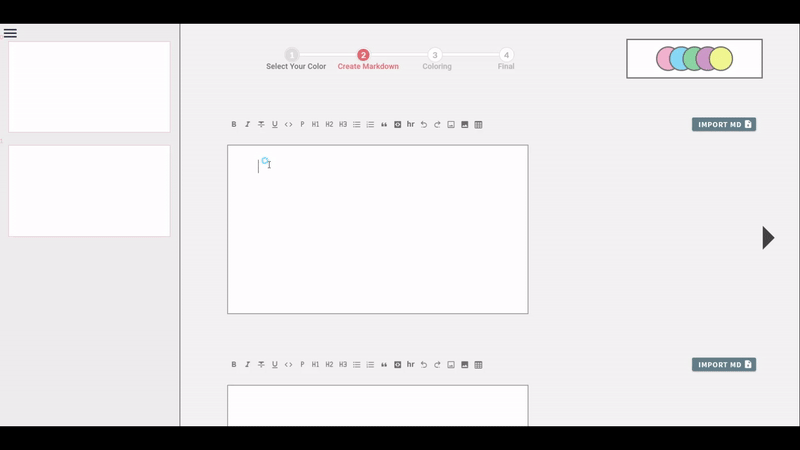
 

- ToolBox
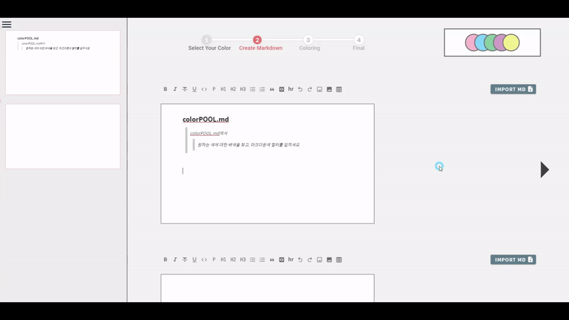
 

- Import : 로컬 md파일 import
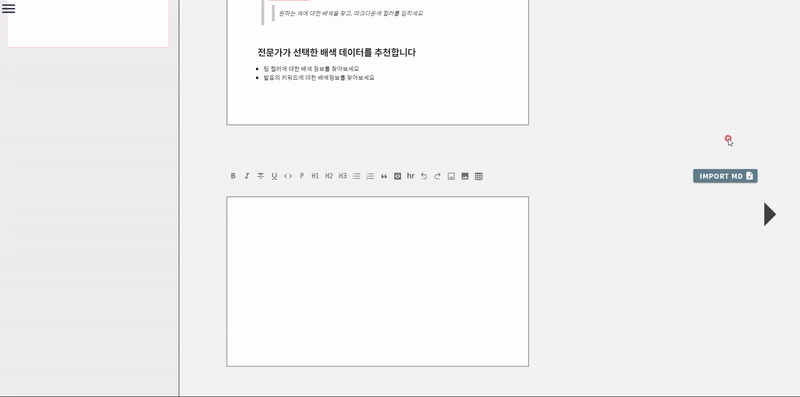
 

- Codeblock : with Highlighting
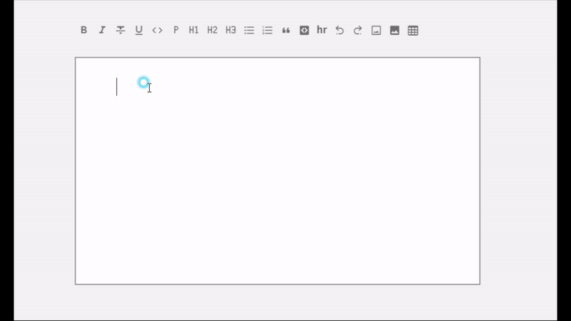
 

- Image
    - URL
    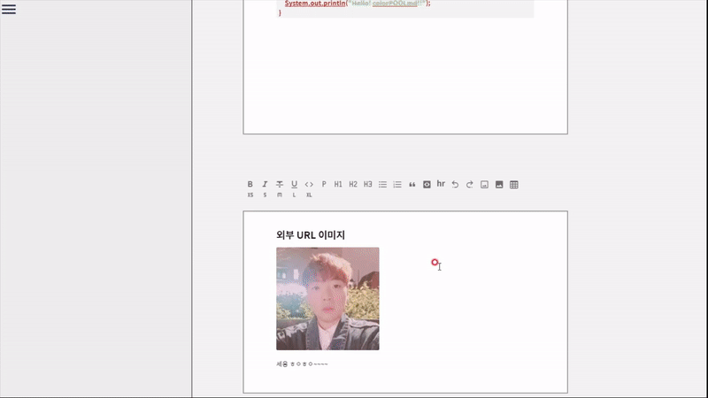

    - Local
    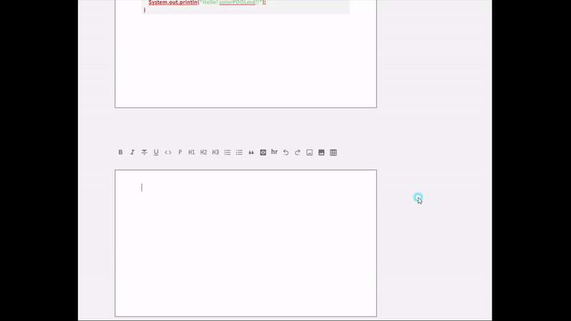
  

### Coloring
- Background
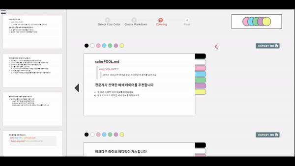
 

- Text
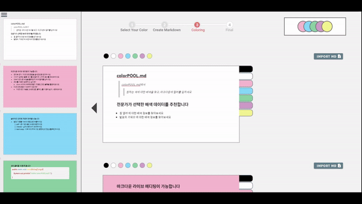
  

### Export
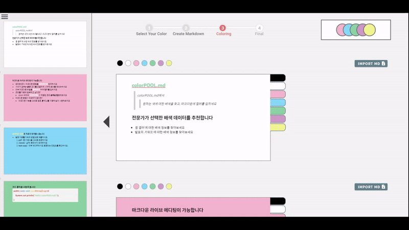

