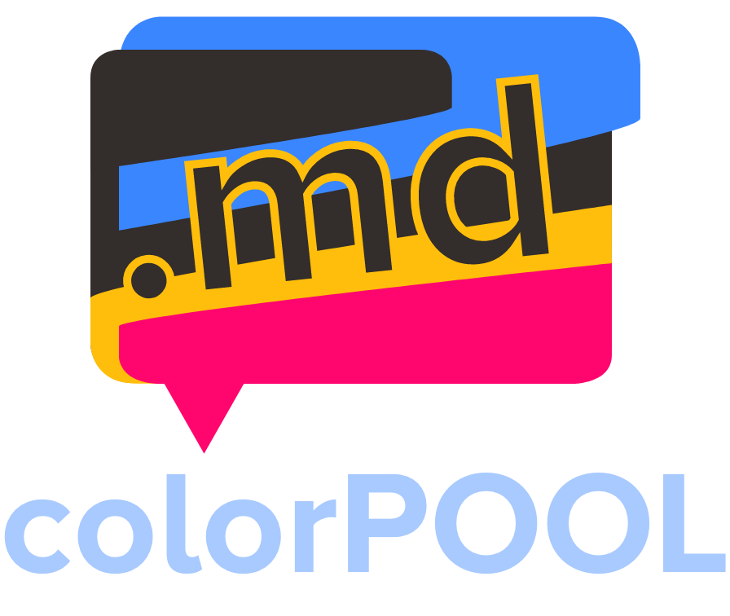
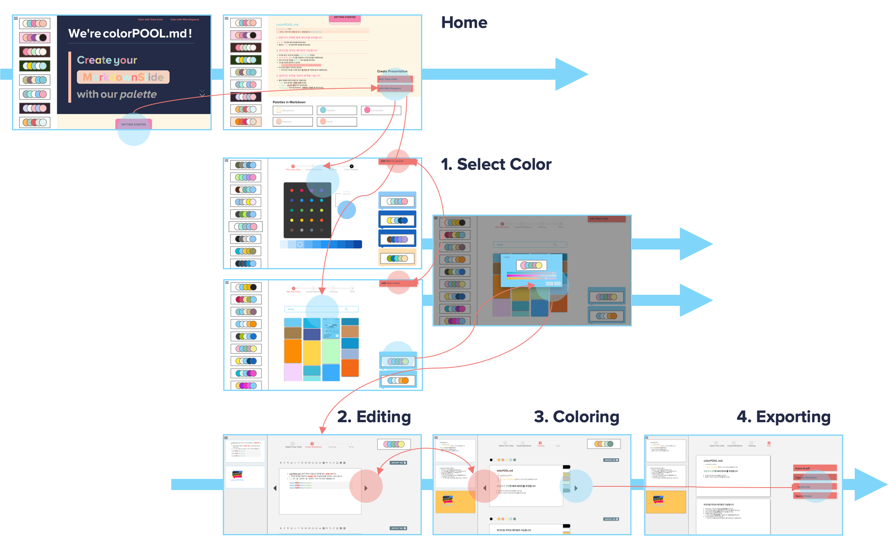
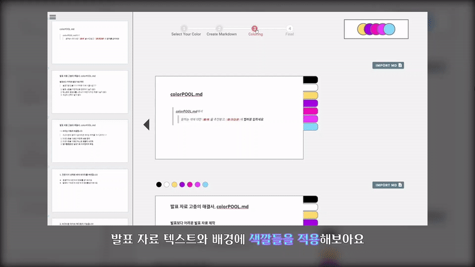

  

Create your presentation with your palette using the knowledge of millions of designers

   
  

 

 

## Index

### Introduction

- [What is colorPOOL.md?](#what-is-colorPOOL.md?)
- [Why colorPOOL.md?](#why-colorPOOL.md?)

### Features

- [Get recommendation](#get-recommendation)
- [Edit your presentation](#edit-your-presentation)
- [Color your presentation](#color-your-presentation)
- [Get your presentation](#get-your-presentation)

### Infra

- [Web Infra Structure](#web-infra-structure)
- [Big Data](#big-data)

### Documents

- [Docs](#docs)
- [Tasks](#tasks)

 

 

## What Is ColorPOOL.md?

> colorPOOL.md에서 원하는 색에 대한 배색을 추천받고, 마크다운에 컬러를 입히세요

- **colorPOOL.md**는 팀의 개성과 키워드의 컬러를 담은 배색을 추천합니다
- **colorPOOL.md**는 추천한 배색을 이용하여 마크다운 기반의 발표 자료를 작성합니다

 

 

 

## Why ColorPOOL.md?

- 발표자료 제작의 어려움은 다음에서 기인합니다
  1. 발표 내용을 구조적으로 정리하기 쉽지 않다
  2. 텍스트의 중요도를 나타내기 위한 디자인 적용이 쉽지 않다
  3. 색상의 선택이 쉽지 않다
- colorPOOL.md는 이렇게 해결합니다
  1. 마크다운을 이용한 **구조적 내용 정리**
  2. 마크다운을 이용한 텍스트 **흐름의 시각화**
  3. 컬러를 활용한 발표자료 **아이덴티티** 확립

 

 

## Get Recommendation

>  컬러를 선택하고, 해당 컬러에 대한 배색을 추천받으세요
>
>  **Team Color**와 **Main Keyword**, 두 가지 방법으로 컬러를 선택할 수 있습니다

 

### Team Color

> colorPOOL의 200가지 컬러를 직접 선택해보세요

- 20개의 대표 컬러군 중 하나를 선택하면, 해당 컬러군에 속하는 10개 컬러를 밝기 별로 살펴볼 수 있습니다

- 컬러 선택을 완료하여, 배색 10가지를 추천받으세요

 

### Main Keyword

> 키워드를 입력하여, 키워드를 대표하는 컬러를 선택해보세요

- 구글 이미지 검색 결과에 대해 대표색을 보여주는 방식입니다
- 검색의 결과는 colorPOOL의 대표 컬러와 가장 가까운 컬러로 보여집니다

 

 

## Edit Your Presentation

> 마크다운 라이브 에디팅 기능을 이용하여, **슬라이드 단위**로 발표자료를 작성하세요
>
> ColorPOOl md가 지원하는 **마크다운 기능**들을 사용해보세요

 

### Slide UI/UX

> **슬라이드 단위**로 발표 자료를 제작하는 익숙한 UX를 그대로 경험하세요

- 작성하던 슬라이드 범위를 초과하면, 새로운 슬라이드가 생성됩니다
- PPO의 단축키 그대로, 슬라이드 생성은 `Alt + Enter`, 삭제는 `Alt + Backspace`

 

### Technical Support

> **툴 박스**를 통해 작성할 수 있고, **이미지 첨부**와 **외부 마크다운 파일 불러오기**, **코드 첨부**가 가능합니다

- 프리뷰 없이, 마크다운 문법을 **실시간으로 렌더**하세요

- 마크다운이 익숙하지 않다면 마크다운 기능을 그대로 담은 `툴 박스`를 이용해 쉽게 사용해보세요
- **이미지 첨부**는 물론, **크기를 조절**하여 시각적 효과를 극대화하세요
- 외부 마크다운 파일을 **불러오기** 해보세요
- 코드를 자료에 첨부하고 싶다면 **Atom 테마의 하이라이팅**이 적용된 코드 블록을 활용해보세요

 

 

## Color Your Presentation

> 컬러링을 원하는 영역을 드래그하고, 컬러 버튼을 클릭해 색을 입히세요
>
> **텍스트** 뿐만 아니라 **배경**에도 색을 입힐 수 있습니다

 

### Color Text

> 색을 칠하고 싶은 **텍스트**를 드래그하고 상단의 버튼을 눌러보세요

- 선택한 배색 조합에 기본색인 Black & White를 포함한 컬러 선택지를 제공합니다
- 텍스트 요소를 드래그하고 상단의 색깔 버튼을 누르면 텍스트에 색깔이 입혀집니다

 

### Color Background

> **배경**에 색을 입혀 발표 자료에 색감을 더해 보세요

- 배경에 색을 입혀 발표 자료에 색 아이덴티티를 부여해보세요

 

 

## Get Your Presentation

> 작성한 발표자료를 세 가지 방법으로 추출하세요
>
> **PDF**로 추출할 수 있고, **전용 뷰어**를 통해 확인이 가능하며, 발표 자료 자체를 **복사**할 수도 있습니다

 

### How to Export

- **PDF** - 문서 형식을 그대로 보존하여 추출할 수 있습니다
- **Viewer** - gif의 동작까지 보여줄 수 있습니다
- **Copy Text** - 외부 에디터에서도 호환되는 컨텐츠를 확인할 수 있습니다

 

 

## Web Infra Structure

 

 

## Big Data

### Collect Data

- Adobe Color에서 제공하는 백 만 명의 디자이너가 평점을 매긴 배색 데이터를 수집했습니다
- 45000개의 데이터 중 상위 3000개의 데이터를 추출하여 분석에 활용했습니다
  - 추출한 3000개의 데이터는 평균 평점이 최고 5점 중 4.35, 표준편차가 0.26인 신뢰할 수 있는 데이터입니다

### Set Reference Colors

> `표본 색채를 선정`하기 위해 데이터를 **Quantization** 하고 **Clustering** 했습니다

- 비슷한 색들을 근사하고, 인간이 인식하는 색차와 균등하게 보정하여 군집화했습니다
- 결과로 표본 색채 200개를 선정했습니다
- 화면에서는 200개의 컬러를 20개의 군으로 카테고리화 하여 `컬러 피커`의 형태로 보여줍니다

### Recommend Palette

> `배색을 추천`하기 위해 데이터를 **Clustering** 했습니다

- 배색을 이루는 5개의 컬러 중 표본 색채와의 색차 거리를 계산하여, 표본 색채를 기준으로 군집화했습니다
- 이 중 평점이 상위 10위 안에 드는 배색 조합을 서비스에서 추천하고 있습니다

 

 

## Documents

- [git branch 전략]()
- [git commit message convention]()
- [coding convention]()
- [기획](./docs/deliverables/최종산출물.docx)
- [와이어프레임](https://scene.zeplin.io/project/5f8e304514b1a271a4c79437)

 

 

## See Also

### Contributor

| 이름   | 역할               | 내용                                       |
| ------ | ------------------ | ------------------------------------------ |
| 강세응 | FE, BE, 영상       | coloring과 result                          |
| 김윤진 | FE, 데이터, 기획   | Landing과 Editing 단계의 화면 및 기능 구현 |
| 배현석 | BE, 데이터, 인프라 | 인프라 및 백엔드 서버 구축                 |
 

 

## Awards

- 🥈삼성청년SW아카데미 자율 프로젝트 2등상 수상
- 🎖삼성청년SW아카데미 자율 프로젝트 UCC 경진대회 입상

 

 

### Technologies Used

